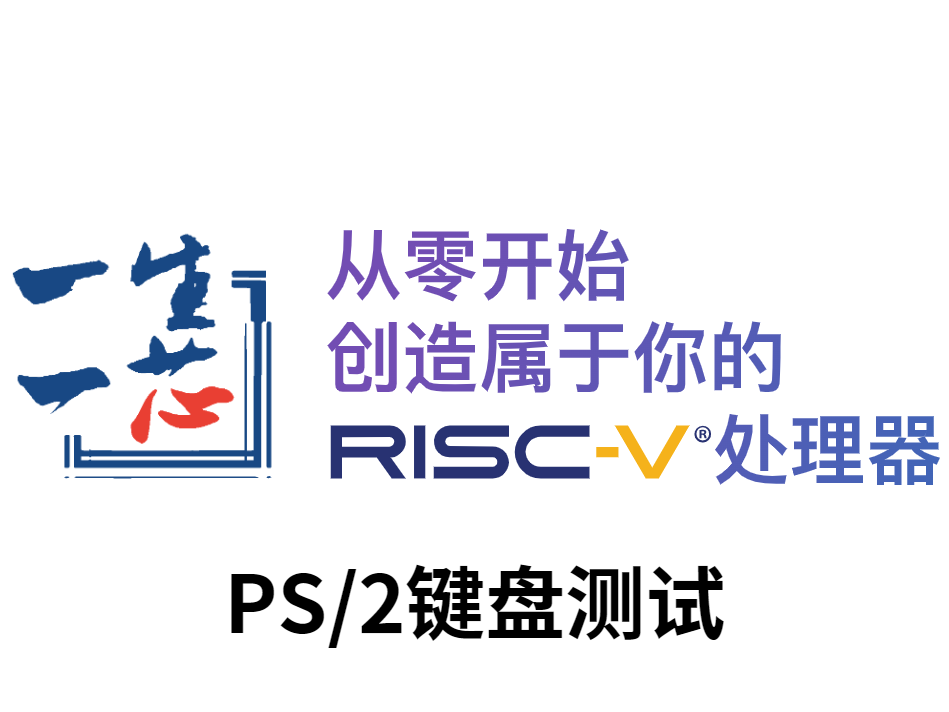

# 测试程序说明

## 文件结构

```sh
ysyxSoC/ysyx/prog
├── bin
│   ├── flash                    # 直接在flash上运行的程序，其中可以对elf文件进行反汇编
│   │   ├── hello-flash.bin
│   │   ├── hello-flash.elf
│   │   ├── kdb-flash.bin
│   │   ├── kdb-flash.elf
│   │   ├── memtest-flash.bin
│   │   ├── memtest-flash.elf
│   │   ├── muldiv-flash.bin
│   │   ├── muldiv-flash.elf
│   │   ├── rtthread-flash.bin
│   │   └── rtthread-flash.elf
│   └── mem                      # 通过loader加载并运行的程序，需要实现fence.i指令才能运行
│       ├── hello-mem.bin
│       ├── hello-mem.elf
│       ├── kdb-mem.bin
│       ├── kdb-mem.elf
│       ├── memtest-mem.bin
│       ├── memtest-mem.elf
│       ├── muldiv-mem.bin
│       ├── muldiv-mem.elf
│       ├── rtthread-mem.bin
│       └── rtthread-mem.elf
├── README.md                    # 本文档
└── src                          # 测试程序的参考代码，用户无需自行编译
    ├── ftom                     # 简单加载器的实现
    ├── hello                    # 输出Hello字符串
    ├── kdb                      # 键盘输入测试
    ├── loader                   # flash加载器的参考实现
    ├── memtest                  # 对8KB数组进行读写测试
    ├── muldiv                   # 乘除法指令测试
    ├── rtthread                 # RT-Thread编译方式说明
    └── run.py                   # 程序编译脚本
```

## 测试程序介绍
运行当前目录下测试程序的处理器核需要至少支持RV64IM和Fence.i指令，仅需支持M特权模式下的Trap和中断处理，不支持U、S和M之间特权级切换。Flash上运行的程序不支持4字节以上的访问，不支持AXI4的Burst请求(APB总线和器件的限制)。AXI4的外设(ps2、vga和sdram)要求后续会更新。我们编译好的测试程序保证没有上述行为。
> 注意：由于ps2、vga和sdram外设还在测试中，所以目前所有的测试都是在`cmd`，即命令行执行环境下运行的。当单独测试某个程序时只需要执行类似`./main.py -t flash hello cmd`命令即可。 
### hello
测试AXI4总线是否能够正确处理读写请求，测试UART外设是否能够正常工作，参考输出如下：
```sh
Hello World!
```

### memtest
测试AXI4能否正确进行MEM和SDRAM的读写操作，程序会执行MEM以及SDRAM的回环测试。其中测试程序会先从MEM地址处写入数值，然后再依次对数值进行assert。然后再将MEM的值拷贝到SDRAM起始地址处并assert。参考输出如下：
```sh
start test...
mem tests prepared
mem tests passed!
sdram tests prepared
all tests passed!!
```

### rtthread
进行复杂的应用程序测试，综合测试定时器中断和Trap等功能的正确性，测试程序会创建线程`thread1`和`thread2`，线程中会输出当前的计数值，并在输出后进行一次40ms的阻塞延时。当线程运行6次后会退出并打印结果。线程发生阻塞延时会被挂起，此时切换线程会进行Trap操作。由于两个线程的优先级和时间片都设置成一样的，所以两个线程会**等时交替执行**，从输出结果上看就是两个线程打印计数值是同步的。rtthread中线程时间片值的递减是按照系统定时器的中断周期为单位进行的，而rtthread的系统定时器是由我们同学们处理器核上的硬件定时器中断实现的。注意`msh />`的输出位置是不固定的，具体的参考输出如下：
```sh
heap: [0x8000d4a8 - 0x8640d4a8]

 \ | /
- RT -     Thread Operating System
 / | \     4.0.4 build Sep 28 2022
 2006 - 2021 Copyright by rt-thread team
Hello RISC-V!
thread1 count: 0
thread2 count: 0
thread1 count: 1
thread2 count: 1
thread1 count: 2
thread2 count: 2
thread1 count: 3
msh />thread2 count: 3
thread1 count: 4
thread2 count: 4
thread1 count: 5
thread2 count: 5
thread1 count: 6
thread2 count: 6
thread1 exit
thread2 exit
```
### muldiv
进行乘除法指令测试，该程序包含三个数值算法测试，分别为欧几里得算法求gcd，矩阵快速幂取模求斐波那契数列和快速数论变换求多项式乘法。该程序会测试乘法，取模等操作的正确性。由于最后一项快速数论变换求多项式乘法需要64位访存操作，然而flash不支持4字节以上的读写请求，所以flash下的`muldiv`不支持最后一项多项式乘法的测试，故flash下的参考输出如下：
```sh
gcd test pass!
fibonacci test pass!
all tests passed!!
```
而mem下的`muldiv`是支持多项式乘法测试的，mem下的参考输出如下：
```sh
gcd test pass!
fibonacci test pass!
polynomial multiplication test pass!
all tests passed!!
```

### kdb
进行支持ps2协议的键盘输入测试。当在Linux图形环境下或者MobaXterm中的命令行中执行键盘测试程序后，等待几秒种，会弹出如下界面：



界面的分辨率是`400X300`。同时等待命令行输出`try to press any key (keyboard)...`后，在弹出的界面中**单次点击**键盘上的26个英文字母键。由于按键的检测是以轮询的方式进行的，所以点击一次按键后要等待大概3~4秒才能在命令行上输出结果。输出结果一次一行，会同时显示26个英文字母键的键值和编码值。当输入的按键没有被程序编码时会输出`xx val not support!!`并在下一行输出该键的编码值。当想提前结束测试程序运行可以用鼠标点击弹出界面右上角的exit按钮，之后程序会释放资源并输出当前弹出界面的刷新帧率。具体的参考输出如下：
```sh
try to press any key (keyboard)...
Got  (kbd): E (24)
Got  (kbd): A (1c)
14 val not support!!
Got  (kbd):   (14)
Got  (kbd): T (2c)
Got  (kbd): E (24)
Got  (kbd): Q (15)
Got  (kbd): I (43)
Got  (kbd): U (3c)
Frames per second: 11776.3
```